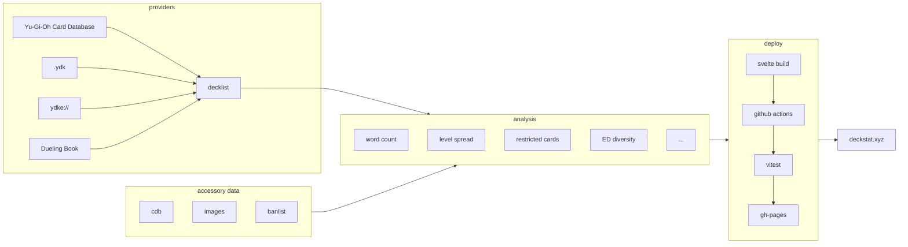

# deckstat

Check your deck!

## Domain Map

```mermaid
graph LR
    subgraph providers
        ydb[Yu-Gi-Oh Card Database]-->dl
        ydk[.ydk]-->dl
        ydke["ydke://"]-->dl
        dub[Dueling Book]-->dl
    end
    
    
    subgraph analysis
        wc[word count]
        lvls[level spread]
        rp[restricted cards]
        edd[ED diversity]
        ...
    end
    dl[decklist]-->analysis

    subgraph accdata[accessory data]
        cdb
        images
        banlist
    end
    accdata-->analysis

    subgraph deploy
        svelte[svelte build]-->gha
        gha[github actions]-->vitest
        vitest-->gh-pages
    end
    analysis-->deploy
    deploy-->deckstat.xyz
```

## Attributions

- https://pixabay.com/photos/tarot-cards-magic-fortune-telling-991041/
- https://cors-anywhere.herokuapp.com/corsdemo
